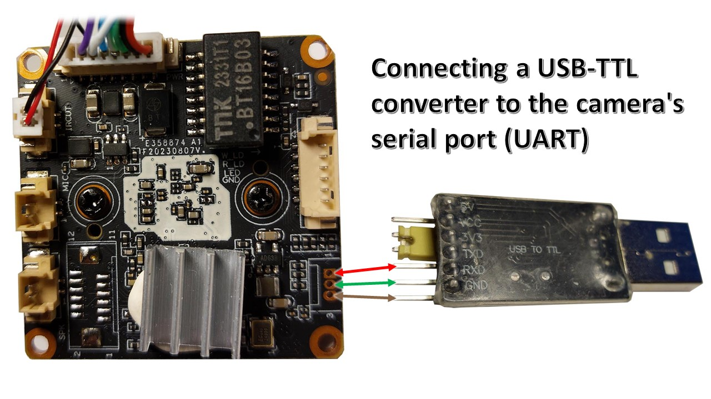
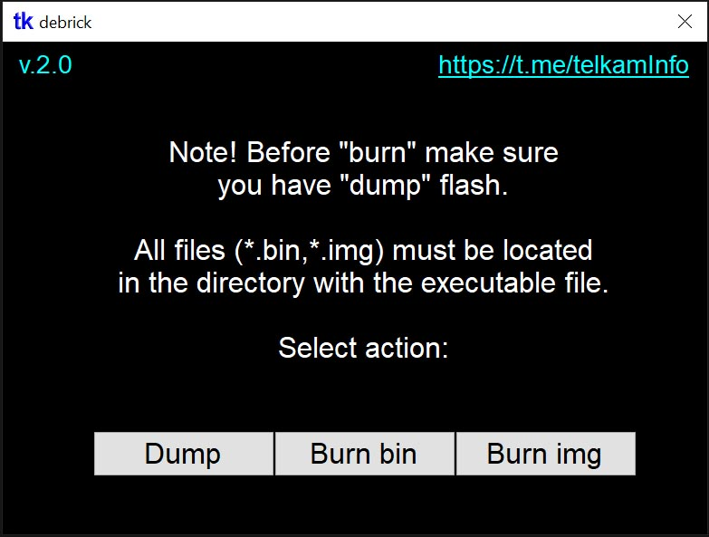

# debrick

Open-source software for Windows, which allows you to flash the camera (on Goke SoC gk7205v200/210/300) in a few clicks, without using the command line and any additional programs (like PuTTY, Tftpd64, python, etc.)

Originally сreated to simplify (automate) the flashing of cameras on [telkam](https://t.me/telkamInfo), but can also be used to read dump flash, restore bricked/passworded cameras and writing [OpenIPC](https://openipc.org/) binary files (similar [burn](https://github.com/OpenIPC/burn)).

## How to use: 

Сonnection:

Run the program, follow the instructions ([video](https://www.youtube.com/watch?v=WQcVlOOUAro&t=111s)):

## Note. 

Don't forget to reboot your device after flashing.

After flashing the OpenIPC binary file, you may need to reboot the device several times, and maybe use PuTTY to install the correct partitions ("run setnor16m"), follow the guide from OpenIPC.